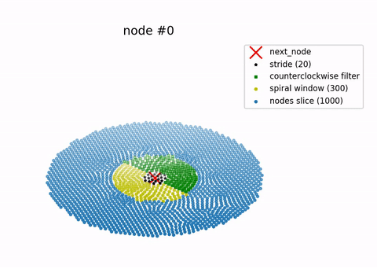

# SpiralSort

A point-cloud spiral-sorting algorithm

 

| requirements        | optional              | os        |
| ------------------- | --------------------- | --------- |
| python3             | pollow>=7.0.0         | GNU/Linux |
| click>=7.0          | matplotlib>=3.1.3     | Windows   |
| numba>=0.48.0       | ffmpeg>=4.1.4         |           |
| numpy>=1.18.0       |                       |           |
| pandas>=1.0.1       |                       |           |

## How to use

1. command line

```bash
$ spiralsort <file_name> <master_node_id>
```

2. inside a python script

```python
from spiralsort.core import spiralsort

point_cloud_sorted = spiralsort(point_cloud, master_node_id)
```

3. docker container

Insert input_file and take the output, using a shared volume between the
host and the container.

```
$ docker pull thanasismatt/spiralsort:latest
$ docker run -it --rm -v ${PWD}:<container_dir> thanasismatt/spiralsort bin/bash
root@<container_id>:/# spiralsort <container_dir>/<file_name> <master_node_id>
```

## How to install

```bash
$ pip install spiralsort
```

## Input/Output file (or DataFrame) format

supported formats: csv, json

| node_id |   x   |   y   |   z   |
| ------- | ----- | ----- | ----- |
| N000    |  1.12 |  2.32 | 12.24 |
| N001    |  1.28 |  2.64 | 13.04 |
| ...

- node_ids have to be unique
- In case of 2D data, just use a constant value for the 3rd dimension.

## How it works

Starting from the *master_node* the algorithm evaluates a cost for each node and
moves to the <br /> node with the minimum cost (cost for node<sup>i+1</sup> is
the distance from node<sup>i</sup> plus the distance from <br /> the
master_node). At each step, a counterclockwise filter is applied, in order to
force a constant <br /> rotational direction.

Optimizing the process, a methodology of slicing is applied on the point-cloud,
described by the <br /> following steps:

1. Sort the point cloud with respect to the distance from the master node
2. Segment it into slices and take the first slice
3. Take a SPIRAL_WINDOW (slice further) <br />
   Spiral windows for the 1st slice consist of 400 nodes, starting from the last
   sorted node <br /> (the master_node for the 1st window)
4. Iteretively pop 15 nodes (a STRIDE), by the minimum cost. Namely, a
   SPIRAL_WINDOW is <br /> sliced to spiralsort a STRIDE of nodes, before moving
   to the next SPIRAL_WINDOW. <br />
   (cost = |node - master_node| + |node - prev_node|) <br />
   At each iterative step, a filter is applied, keeping only nodes from the
   counterclockwise side <br /> of the vector that starts from the master node
   and ends at the previous node, in order to <br /> force the algorithm to move
   on a constant rotating direction.
5. Take the next SPIRAL_WINDOW and pop the next STRIDE. <br />
6. Continue until the remainder of the nodes reaches the size of the
   half slice (1000 nodes for <br /> the 1st slice).
7. Merge the remaining nodes with the next slice <br />
   This overlap of the slices ensures that there is a continuity while
   selecting the next nodes, <br /> when the algorithm reaches the last nodes of
   the slice.
8. For the next slices, while moving away from the *master_node*, the
   SPIRAL_WINDOW is <br /> selected differently. Specifically, before each
   STRIDE, the counterclockwise filter is applied, <br /> then the remaining
   nodes are cost-sorted (with respect to their cost) from the last <br />
   spiralsorted node and, finally, a SPIRAL_WINDOW is sliced, to start the
   iterative spiralsorting <br /> of the nodes in the next STRIDE.
9. Keep moving by SPIRAL_WINDOWs, counterclockwise
   filtering at each stride, popping <br /> STRIDEs of nodes until the half
   slice thresshold.
10. Upon reaching the last slice, remove the *half_slice* threshold, to
   pop all the remaining nodes.

## Options

**--output-format=<format** **>** <br />
(suported: csv, json, xlsx; defaults to the format of the input
                 file) <br />
**--save-animation/--no-save-animation** <br />
(defaults to false)

## How to create an animation of the process


1. command line

```bash
$ spiralsort <file_name> <master_node_id> --save-animation
```

2. inside a python script

```python
from spiralsort.spiralsort_post import save_animation

save_animation(point_cloud_sorted, path_to_input_file)
```

<br />

> (C) 2020, Thanasis Mattas <br />
> atmattas@physics.auth.gr
